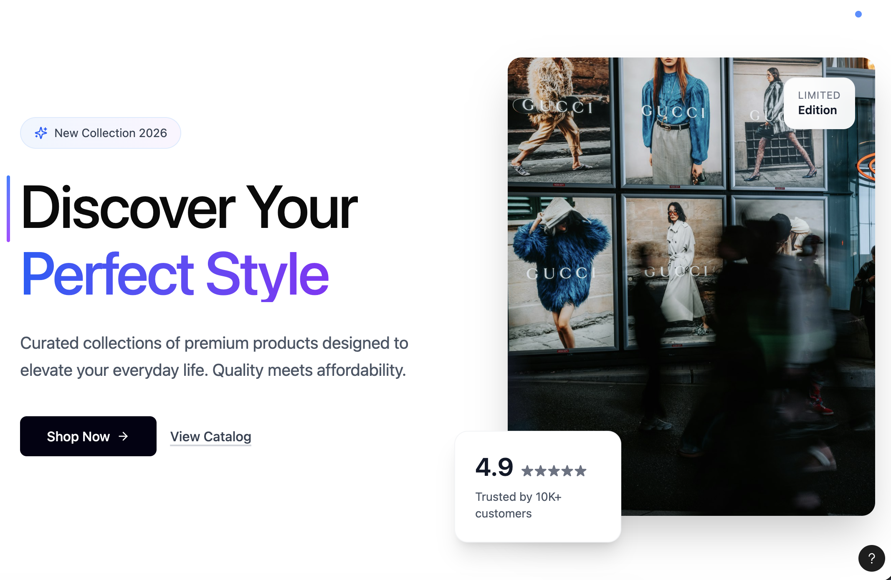
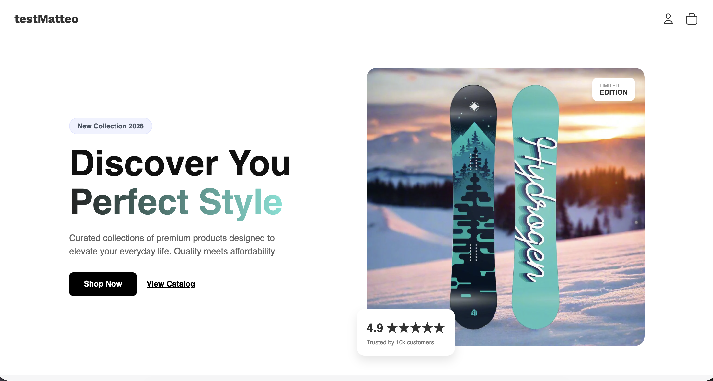
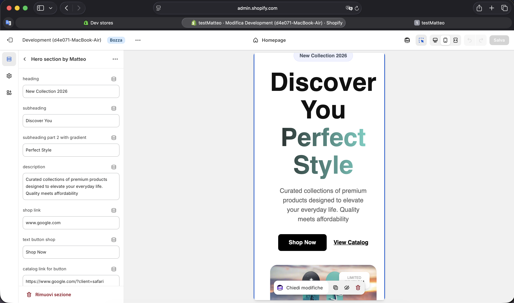

# Shopify Custom Hero Section: From Mockup to Liquid

Questo progetto nasce dalla volontà di replicare un flusso di lavoro reale nello sviluppo di temi Shopify: partendo dalla fase di **design concept** fino alla realizzazione di una **sezione dinamica** pronta per lo store.

## 🚀 Il mio Workflow

1. **Design & Ideazione**: Ho iniziato utilizzando **Figma AI** per generare un mockup della hero-section. Volevo un design moderno con una gerarchia visiva chiara.
2. **Sviluppo Liquid**: Ho scritto il codice della sezione in Liquid, creando tutti i collegamenti necessari (Schema) per fare in modo che testi e immagini fossero modificabili dall'editor di Shopify.
3. **Replicazione del Mockup**: Tramite il CSS, ho trasformato il codice grezzo nella versione finale, cercando di essere il più fedele possibile al design creato su Figma.

## 🛠 Caratteristiche Tecniche (Livello Junior)

### 1. Architettura Liquid Dinamica
La sezione è stata pensata per essere facile da usare per il cliente:
- **Gestione Titolo**: Ho diviso il titolo in due campi distinti nel Customizer. Questo mi ha permesso di applicare lo stile sfumato solo alla seconda parte del testo in modo semplice e pulito.
- **Schema Settings**: Ho inserito i settaggi per immagini, etichette dei bottoni e link, rendendo la sezione riutilizzabile.

### 2. Styling CSS Moderno
- **Effetto Gradiente**: Per la scritta colorata, ho utilizzato la proprietà `background-clip: text`.
- **Posizionamento Badge**: Ho usato il posizionamento assoluto per inserire i badge (come il rating e la limited edition) sopra l'immagine, proprio come apparivano nel design originale.
- **Interazioni**: Ho aggiunto semplici effetti di hover sui bottoni per rendere la sezione più interattiva per l'utente.

## 📂 Contenuto del Repository

- `hero-section.liquid`: Il file che contiene il markup HTML e le impostazioni (Schema).
- `hero-section.css`: Il file con tutto lo stile della sezione.

---

## 📸 Anteprima del Progetto

### 1. Il Mockup (Figma AI)

### 2. Il Risultato Finale (Shopify Store)

### 3. Il Risultato Finale Mobile (Shopify Store)

